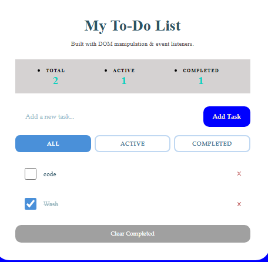

# Week 7: Vanilla JavaScript Projects — Shopping Cart, Todo List & Debugging

## Author

- **Name:** Concepter Bosibori.
- **GitHub:** [@Connie-cloud-svg](https://github.com/Connie-cloud-svg)
- **Date:** April 24th, 2026

## Project Description

A collection of three JavaScript projects built during Week 7 of the IYF Weekend Academy Season 10. The main focus was solidifying core JavaScript skills — working with the DOM, handling asynchronous API calls, managing state without a framework, and debugging real-world code errors.

- **ShoppingCart** — A fully interactive shopping cart that fetches products from an external API, supports category filtering, and features a slide-in cart drawer.
- **TodoList** — A task manager app where users can add, complete, and remove todos, with the list persisting through the session.
- **BuggedCode** — A debugging exercise folder containing intentionally broken code that was analysed and fixed to reinforce problem-solving skills.

## Technologies Used

- HTML5
- CSS3
- JavaScript (ES6+)
- Fetch API (async/await)
- DummyJSON / FakeStoreAPI (external product APIs)
- ESLint (code linting)
- Prettier (code formatting)

## Features

### Shopping Cart
- Fetches live product data from an external REST API
- Skeleton loading states while data is being retrieved
- Category-based filtering
- Slide-in cart drawer with add/remove item support
- Dynamic total price calculation

### Todo List
- Add new tasks via input form
- Mark tasks as complete/incomplete
- Delete individual tasks
- Clean, minimal UI

### BuggedCode
- Debugging exercises to identify and fix common JavaScript errors
- Covers issues like scope, async handling, DOM manipulation bugs, and syntax errors

## How to Run

### Shopping Cart / Todo List
1. Clone this repository:
   ```bash
   git clone https://github.com/Connie-cloud-svg/iyf-s10-week-07-Connie-cloud-svg.git
   ```
2. Navigate into the project folder you want to run:
   ```bash
   cd ShoppingCart
   # or
   cd TodoList
   ```
3. Open `index.html` directly in your browser — no build step needed.

> **Note:** The Shopping Cart fetches from an external API, so an internet connection is required.

## Lessons Learned

- How to use `fetch()` with `async/await` to retrieve data from a REST API and handle loading and error states gracefully.
- How to manipulate the DOM dynamically — creating, updating, and removing elements based on user interactions and API responses.
- The importance of separating concerns in vanilla JS — keeping data logic, UI rendering, and event handling in distinct functions.
- How to read and understand someone else's broken code by tracing execution flow and reading error messages carefully (from the BuggedCode exercises).
- How to set up ESLint and Prettier to enforce consistent code style across a project.

## Challenges Faced

- **API response structure** — Different APIs (FakeStoreAPI vs DummyJSON) return data in different shapes. I had to adapt my rendering logic for each and learn to read API documentation carefully.
- **Skeleton loaders** — Implementing loading placeholders that look good and get replaced cleanly once real data arrives took several iterations to get right.
- **Cart state management** — Tracking which items were in the cart, their quantities, and the running total without a state management library required careful thinking about where to store and update data.
- **`node_modules` committed to Git** — Early on I accidentally committed the `node_modules` folder. I later fixed this by adding a `.gitignore` and removing the folder from tracking with `git rm -r --cached node_modules`.

## Screenshots 



